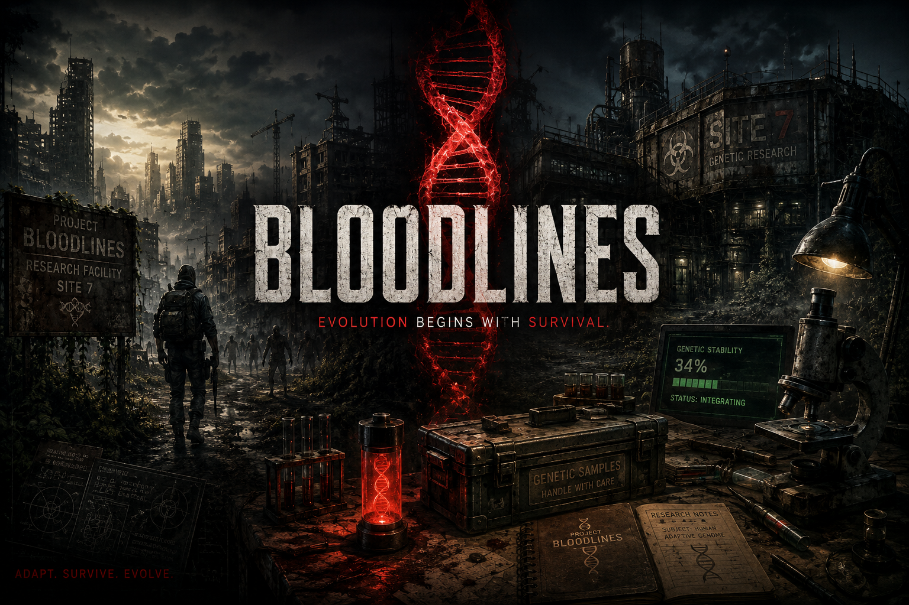

# Bloodlines

> **Evolution begins with survival.**

A gritty **genetic progression overhaul** for **7 Days to Die v3.0+**.

Bloodlines reimagines progression through rediscovered biotechnology rather than traditional skill trees. Survivors recover DNA Fragments, sequence DNA Helixes, increase Genetic Stability, and evolve one of six unique Bloodlines while rebuilding humanity's lost research.

---

## Core Features

- 🧬 Six unique Bloodlines
- 🧬 DNA Helix progression
- 🧬 Genetic Stability system
- 🧬 Bloodline Keystone
- 🧬 Base technology progression
- 🧬 Rediscovered biotechnology lore
- 🧬 Designed for solo and multiplayer

---

## Development Status

**Alpha 0.1 — Genesis**

Bloodlines is currently in active development.

Follow the roadmap in the `docs` folder to track progress through Genesis, Awakening, Knowledge, Cornerstone, and beyond.

---

## Author

**ApexVibe**